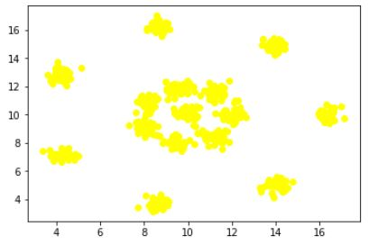
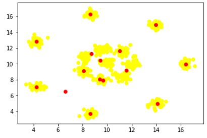

# Self_Organizing_Map

## Requirement

*  Python 3.6
*  matplotlib
*  pandas

## How to Run

Buka terminal > Pindah direktori sesuai dengan letak file > Jalankan command `python som.py` pada terminal

#### SOM

SOM adalah salah satu algoritma machine learning yang termasuk kedalam tipe Artificial Neural Network. Training algoritma SOM termasuk kedalam Unsupervised Learning.

#### Data dan Hasil

Dalam algoritma ini, akan dilakukan pemberian class atau label, atau sering disebut juga dengan clusterring. Dataset yang digunakan adalah Dataset.xls. Dalam dataset tersebut, memiliki 2 atribut yaitu x dan y, dan apabila dilakukan visualisasi data, maka akan didapatkan gambar seperti dibawah ini

Terlihat jelas bahwa dalam dataset memiliki 15 class yang tersebar. Apabila dilakukan proses training terhadap algoritma SOM, akan didapatkan gambar seperti dibawah ini

Dimana scatter kuning adalah dataset, dan scatter berwarna merah adalah hasil centroid yang didapatkan untuk menggambarkan masing-masing class dari 1 hingga 15.
